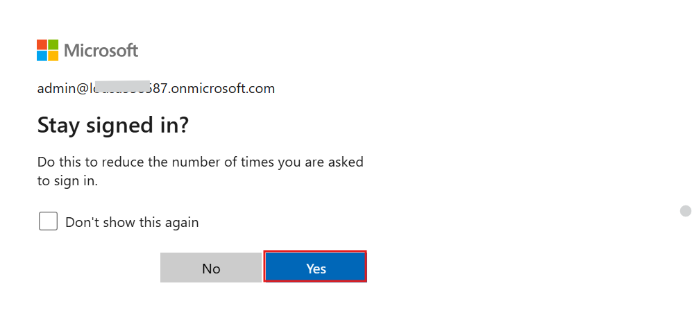
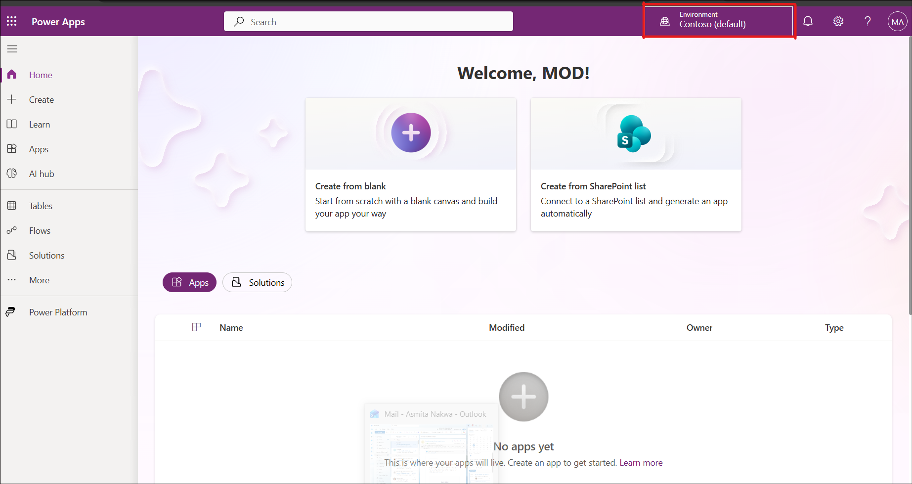
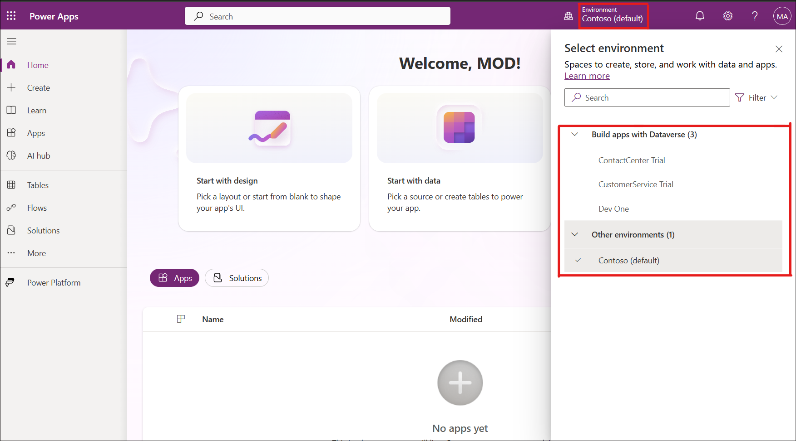
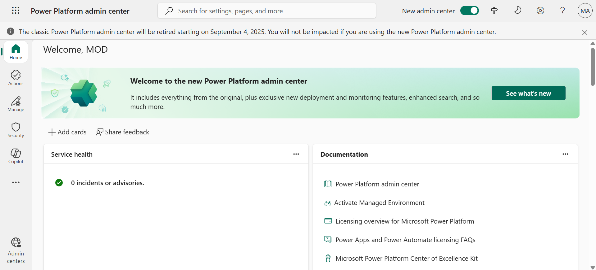
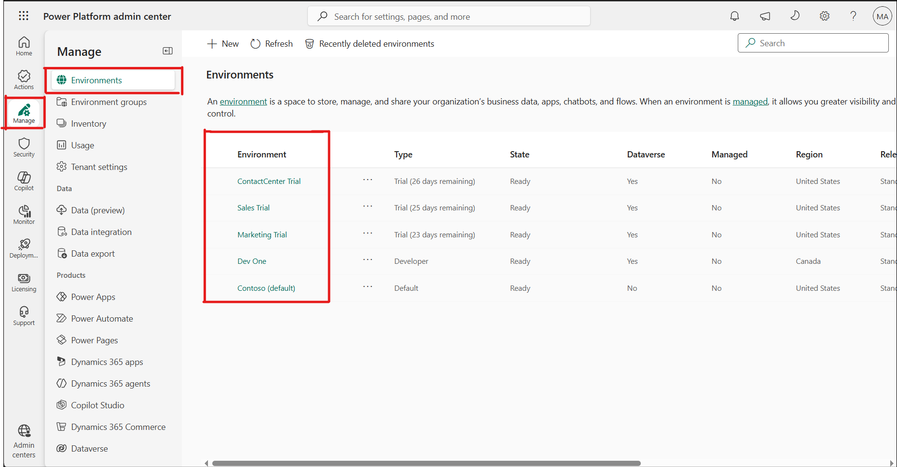

----
lab:

    title: Setting up lab environment

    description: Set up a trial environment for Microsoft Power Platform and Dynamics 365. Configure environments, Copilot capabilities, and required add-ins to prepare the environment for hands-on learning activities throughout the course.

    duration: 15 mins

    level: 200

    islab: True

    primarytopics: Power Platform
---

# Setting up the lab environment

In this lab, you will set up a complete trial environment required for working with Microsoft Power Platform and Dynamics 365 applications. You will sign up for trial licenses, configure environments, enable Copilot capabilities across services, and install required add-ins to support learning activities throughout the course.

## **Exercise 1: Assign a Power Apps trial license**

1.  Open a web browser on your VM and go to
    +++[**https://powerapps.microsoft.com/en-us/free/**](https://powerapps.microsoft.com/en-us/free/)+++

2.  Select **Start free**.

3.  Enter your **Office 365 admin credentials**, check the checkbox to
    **accept the agreement,** and click on **Start free**.

4.  Enter your **Microsoft 365** tenant admin password, and then select
    **Sign in**.

5.  Select **Yes** on **Stay signed in?** pop-up window.

6.  Keep the **United States** as your **country/region** and then click
    on the **Get started** button.

7.  You can now view the **Power Apps** home page with the default **Contoso (default)** environment, which is created for you.

8.  From the drop-down list, select the required **environment** for the lab.

9.  Open the new tab and go to the **Power Platform admin center** by navigating to +++[**https://admin.powerplatform.microsoft.com**](https://admin.powerplatform.microsoft.com)+++ and if required, **sign in** using your given Office 365 admin tenant credentials.

10. From the left navigation pane, select **Manage** > **Environments**, and then select the **Dataverse environment** required for the lab from the list of environments.

**Conclusion** 
You have successfully activated the **Power Apps** trial license and verified that the required **Dataverse-enabled environment** is available in the **Power Platform admin center**, providing the environment required for the lab activities.