---
lab:

title: Create AI customer journeys with Journey Creation Agent – Journeys

description: Learn how to use the Journey Creation Agent in Dynamics 365 Customer Insights – Journeys to create AI-generated customer journeys, build audience segments with natural language, and publish personalized marketing experiences using Copilot.

duration: 30 mins

level: 300

islab: True

primarytopics: Dynamics 365 Customer Insights- Journeys
---

# Create an AI-Assisted Customer Journey with the Journey Creation Agent in Customer Insights – Journeys

In this lab, you will use Copilot in Customer Insights – Journeys to build a fully automated, AI-assisted customer journey. You will enable the Journey Creation Agent, create and configure a target segment, generate a multi-step journey from a natural language prompt, review and adjust the Copilot-generated steps, and publish a live, running journey.

## Enable Copilot in Customer Insights – Journeys**
1. Go to **Power Platform admin center** by navigating to +++ https://admin.powerplatform.microsoft.com +++ and if required, sign in using your given **Office 365 admin tenant** credentials.

2. From the left navigation pane, select **Manage** \> **Environment** and then click on **Marketing trial**.

 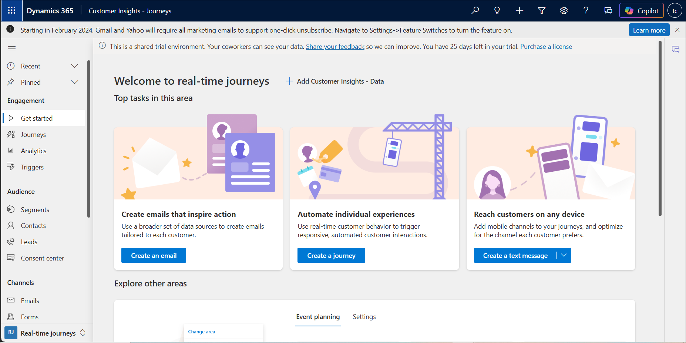

3. Click on **Environment URL**.

 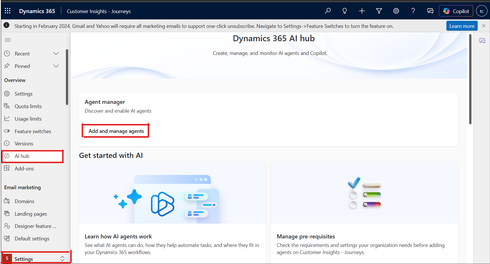
  
5. Select **Customer Insights – Journeys**.

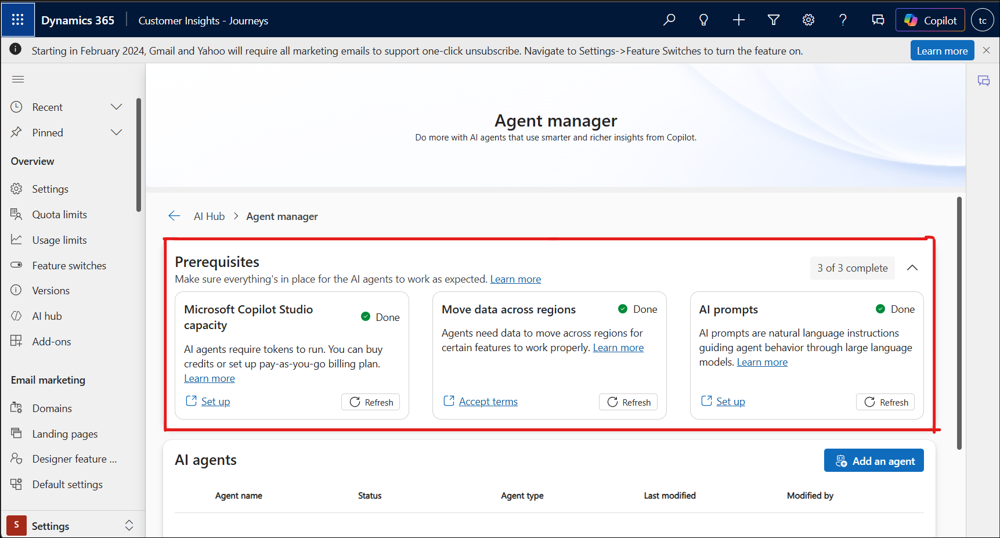

5. Select **Customer Insights – Journeys** if asked.

 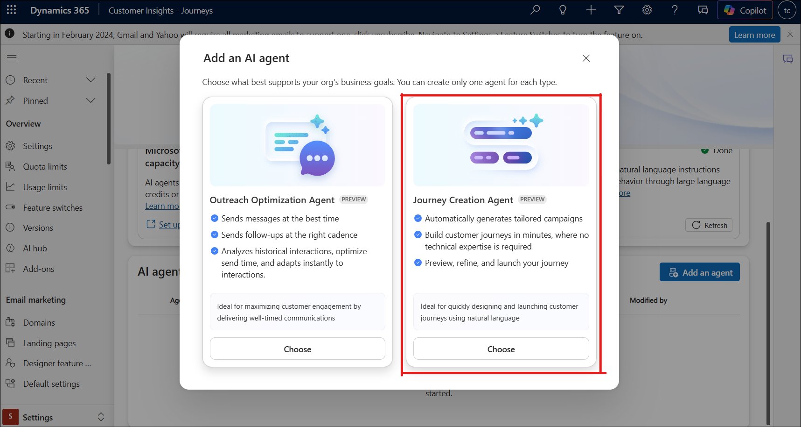

## **Exercise 1 - Enable and access the Journey Creation Agent**

**Objective**: Turn on the Journey Creation Agent in the Dynamics 365 AI hub and confirm you can access it from Customer Insights – Journeys before you start building a journey.

### Task 1: Open the AI Hub

1. Navigate to the **Customer Insights – Journeys portal**. The Welcome to real-time journeys home page opens, displaying quick-start tiles for creating emails, journeys, and text messages.

2.  In the left-hand navigation, select **Settings**, then choose AI hub to open the area where AI agents are managed.

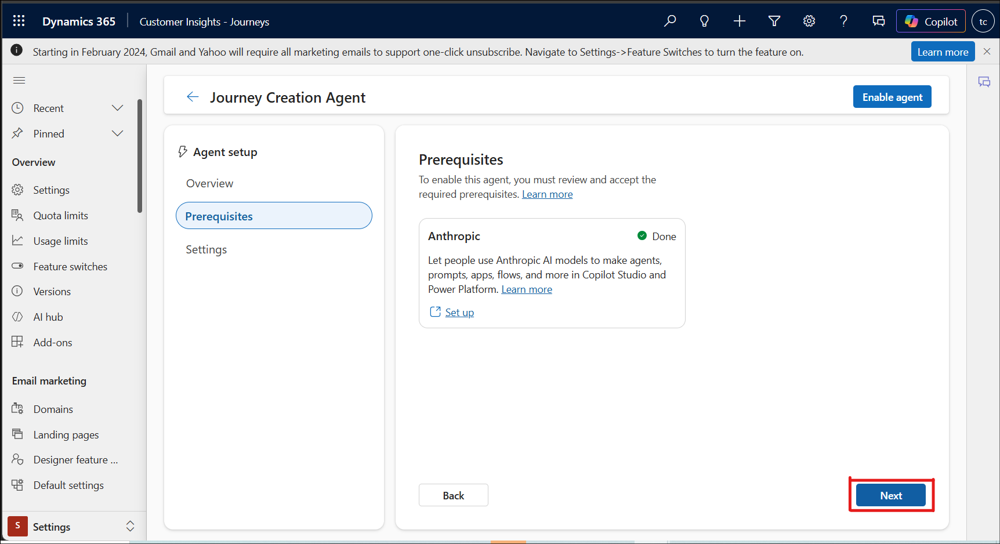

### Task 2: Add Journey Creation Agent

1. On the Dynamics 365 AI hub page, select **Add and manage agents** under Agent manager. 
2. Confirm the Prerequisites section shows 3 of 3 complete (Microsoft Copilot Studio capacity, Move data across regions, and AI prompts) before continuing.

3. Select **Add an agent**, then choose the **Journey Creation Agent** card (Preview). This agent automatically generates tailored campaigns and builds customer journeys from natural language. Select **Choose**.

4. Review the agent **Overview**, which explains that the agent interprets your goal, asks clarifying questions, and builds a complete journey with triggers, steps, and waits. Select **Next**.

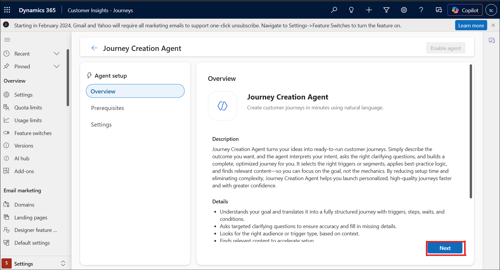

5. On the **Prerequisites** tab, confirm **Anthropic** shows a Done status (this allows the agent to use the underlying AI model), then select Next.

6. On the **Settings** tab, review the message consumption limit option, then select **Enable** agent.

7. A confirmation dialog appears once the agent is ready. Select **Got it**, to close it.

8. Back on the **Agent manager** page, verify that **Journey Creation Agent** now appears in the AI agents list with a Status of Enabled.

### Task 3: Open the Customer Insights – Journeys App

1. Go to **+++https://powerapps.microsoft.com +++** and select **Apps** in the left navigation to view the apps available in the environment.

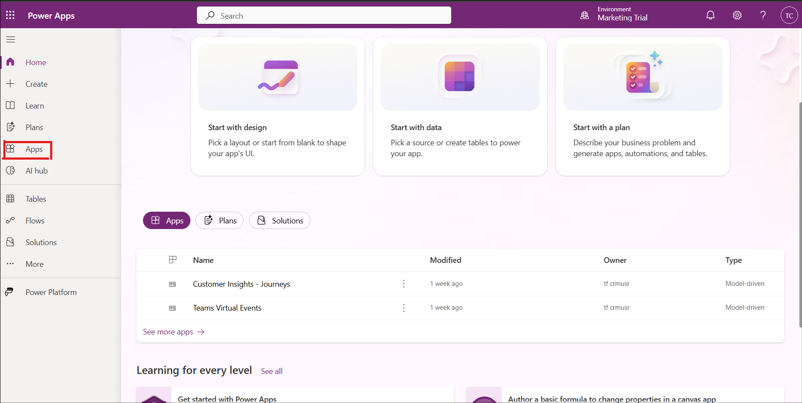

2. In the apps list, locate **Customer Insights – Journeys** and select the **edit (pencil)** icon to open it, or select the app name to launch it directly.

3. The app opens and displays the **Journeys area**. Confirm you can see the **All Journeys list** before moving to the next exercise.

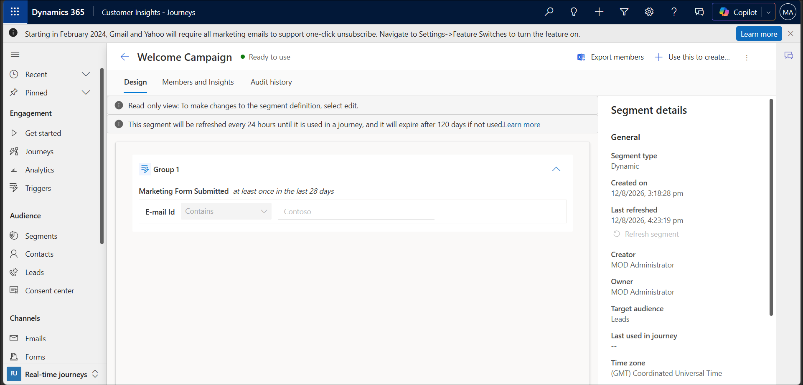

## **Exercise 2 – Create a target segment**

**Objective**: Build a segment that identifies new customers who should receive the welcome campaign, so the journey you generate in Exercise 3 has an audience to target.

### Task 1: Create a New Segment

1. Go to **Customer Insights – Journeys \> Audiences \> Segments**.

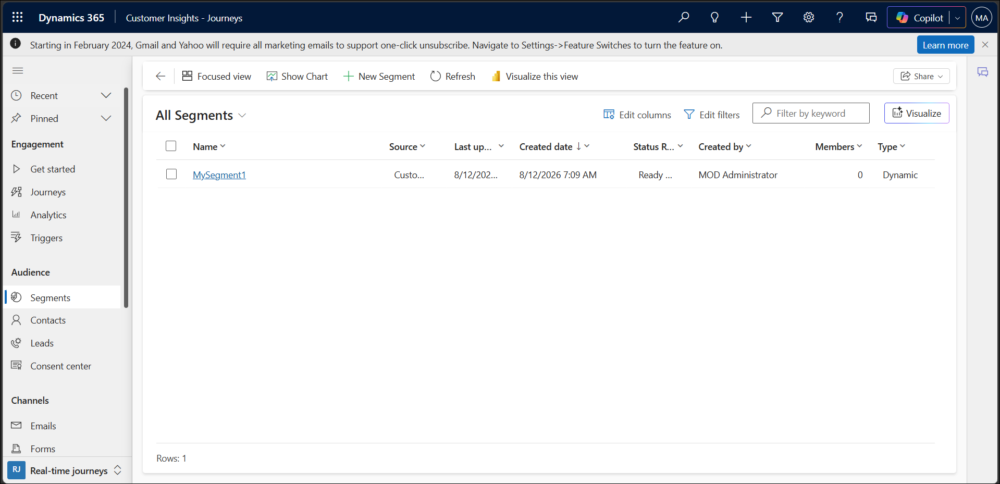

2. Select **New Segment** to open the segment creation pane.

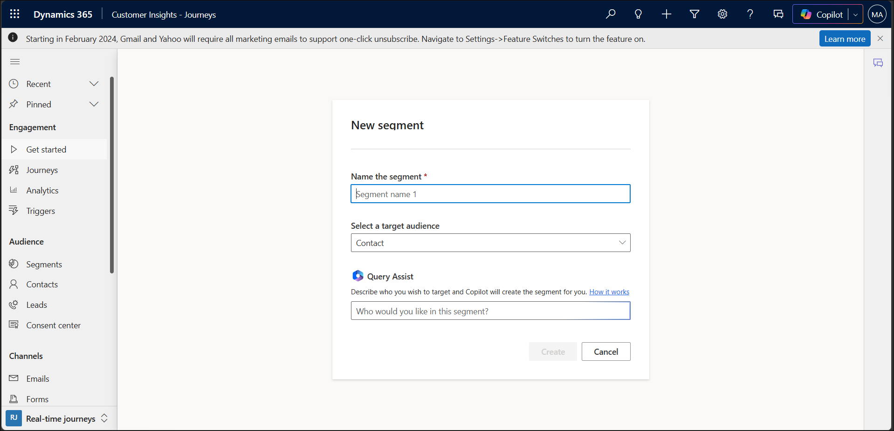

3. Name the new segment **New Customers - Welcome Campaign** and select **Lead** from the Select a target audience drop-down list.

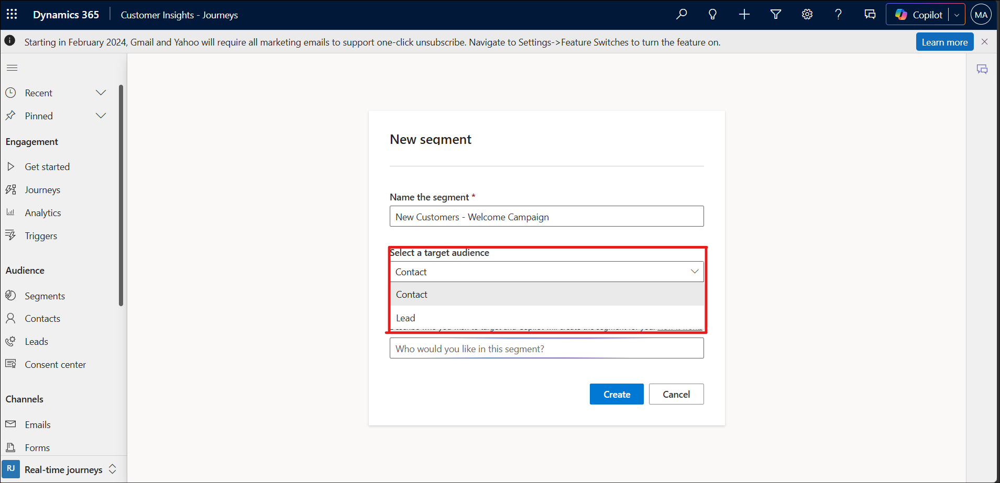

### Task 2: Define the Segment Condition with Query Assist

1. In the Query Assist box, describe the audience in natural language —for example, **leads whose e-mail address contains Contoso and who submitted a marketing form at least once in the last 28 days** — and let Copilot build the matching condition. Select **Create** to save the segment.

2. Open the **Design** tab of the segment (here shown for the **Welcome Campaign segment**) to review the generated condition group. Confirm it reads: **Marketing Form Submitted** **at** **least once in the last 28 days**, with E-mail Id Contains **Contoso**. In the Segment details pane on the right, confirm the Segment type is Dynamic, and the Target audience is set to Leads.

3. Note that the segment status shows **Ready to use** once processing completes. The panel also confirms the segment refreshes every 24 hours until it is used in a journey and will expire after 120 days if it remains unused.

## **Exercise 3 – Generate the journey with Copilot**

**Objective**: Use the Journey Creation Agent to turn a plain-language description into a complete, multi-step customer journey that targets the segment created in Exercise 2.

### Task 1: Start the Journey Creation Agent

1. From the Journeys area, select **New journey**. The Create new journey dialog opens on the Journey Creation Agent (Preview) tab, prompting What would you like to plan today?

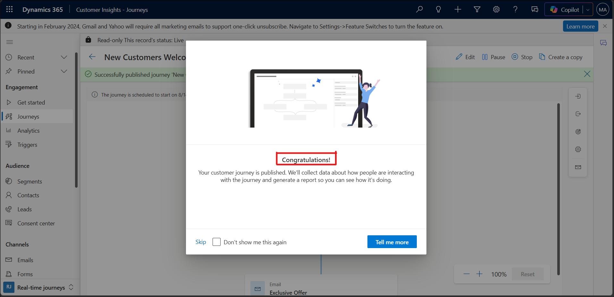

2. In the prompt box, enter: **Create a journey that will send a welcome email to all new customers that are part of the New Customers – Welcome Campaign segment. After two days, send them an exclusive offer email.** Select the **Send** (arrow) icon.

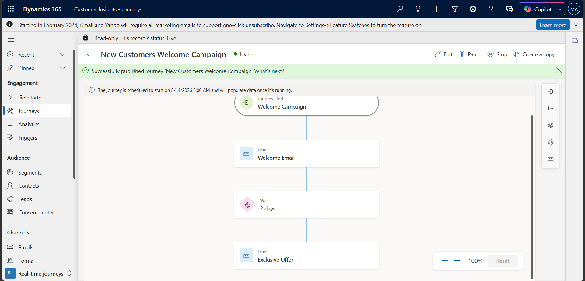

### Task 2: Review the Generated Journey

1. Wait while the agent’s reasons through the request. When it finishes, review the summary it provides, confirming the audience (New Customers - Welcome Campaign segment) and the Welcome Email send step.

2.  On the canvas, confirm the generated journey structure: **Journey start \> Email (Welcome Email) \> Wait (2 days) \> Email (Exclusive Offer) \> Exit.** Adjust any step if needed before continuing.

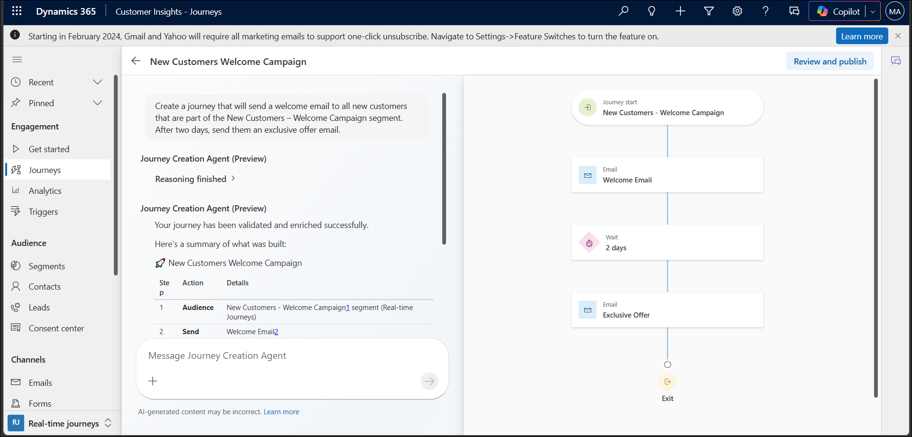

## **Exercise 4 – Review and publish the journey**

**Objective**: Publish the completed journey so it goes live and starts
running against the target segment.

### Task 1: Publish the Journey

1. Select **Review and publish** in the top-right corner of the journey canvas, then confirm the publishing action.

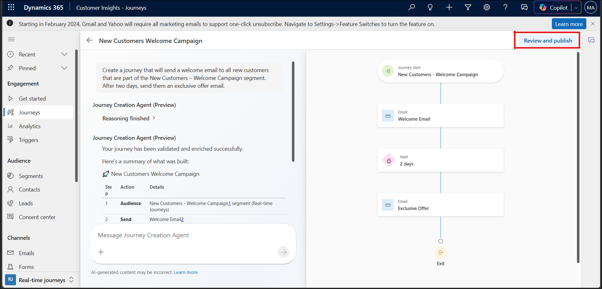

2. When the confirmation dialog appears, select **Skip or Tell me more** to close it.

### Task 2: Verify the Journey Is Live

1. Verify that the journey status is **Live** and that a **scheduled start date and time** are displayed.

2. Review the final journey canvas and verify that it includes the **Welcome Campaign** trigger, **Welcome Email**, **2-day wait**, and **Exclusive Offer** email.

## **Summary**
In this lab, you enabled the Journey Creation Agent in the Dynamics 365 AI hub and confirmed access to it through the Customer Insights – Journeys app. You created a target segment (New Customers - Welcome Campaign) and used Query Assist to define its membership conditions with natural language. You then used the Journey Creation Agent to generate a complete, multi-step journey from a text prompt, reviewed the Copilot-generated steps — a welcome email, a two-day wait, and an exclusive offer email — and published the journey so it is now live and running against your segment. You have practiced the end-of-the-end workflow for building AI-assisted customer journeys with Copilot, from agent setup through publishing.
